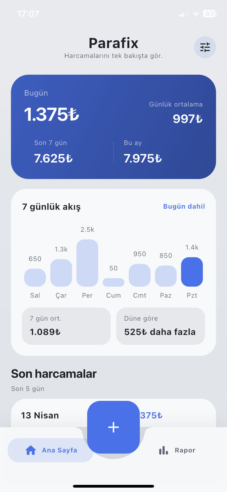
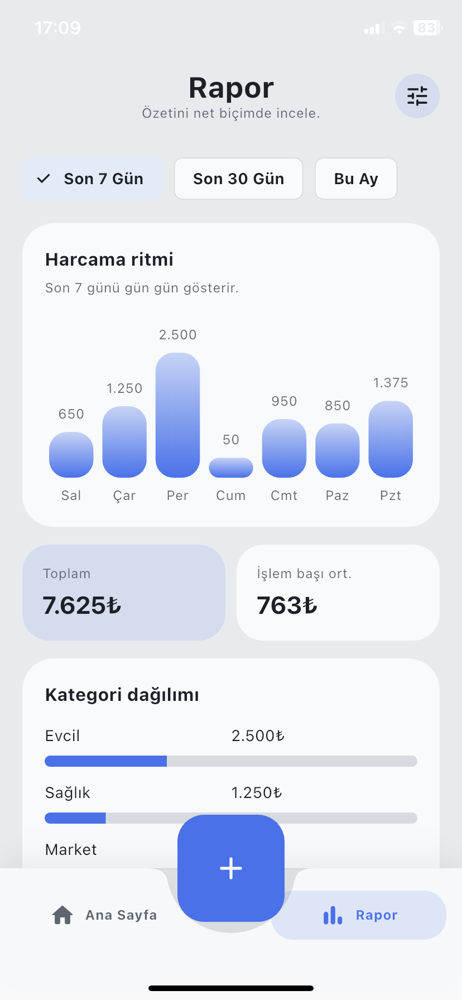
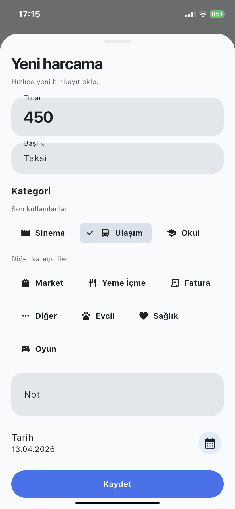
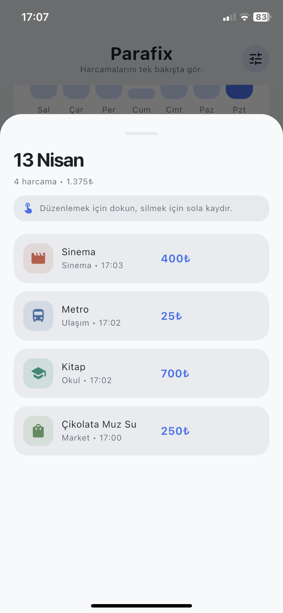
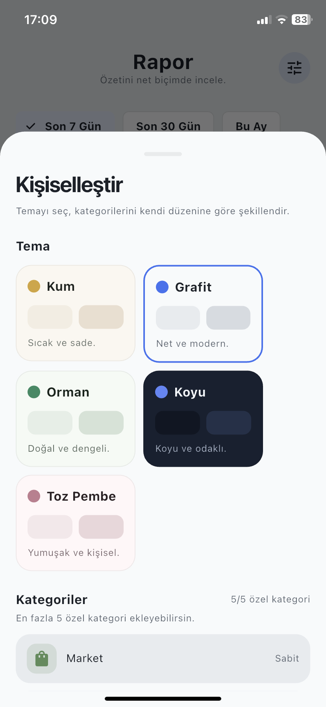

# Parafix


Parafix, sade ve akıcı bir gider takip deneyimi sunmayı hedefleyen bir Flutter uygulaması. Ana odak; hızlı kayıt, net özetler ve düşük cihazlarda da akıcı hissettiren bir kullanım deneyimi.

## Proje Özeti

| Alan | Detay |
| --- | --- |
| Durum | Aktif geliştirme aşamasında |
| Hedef | Basit, kullanıcı dostu ve hızlı gider takibi |
| Ana platform | iOS |
| Arayüz dili | Türkçe odaklı |
| Veri saklama | Cihaz içi yerel saklama (`SharedPreferences`) |

Bu repo şu anda Flutter'ın diğer platform klasörlerini de içeriyor; ancak aktif ürün geliştirmesi öncelikli olarak iOS deneyimi için ilerliyor.

## Öne Çıkan Özellikler

- Hızlı gider ekleme ve mevcut kaydı düzenleme
- Kaydı silme için pratik liste etkileşimleri
- Günlük, haftalık ve aylık toplamları tek ekranda görme
- Son 7 günlük harcama akışı ve düne göre fark gösterimi
- Son 7 gün, son 30 gün ve bu ay için rapor görünümü
- Kategori bazlı dağılım özeti
- Tema seçimi ve özel kategori kişiselleştirmesi
- Hesap oluşturmadan çalışan, yerel öncelikli kullanım yapısı

## Ekran Görüntüleri

| Home | Report |
| --- | --- |
|  |  |

| Add Expense | Day Detail |
| --- | --- |
|  |  |

| Personalization |
| --- |
|  |

## Tasarım Hedefi

Parafix şu üç ilke etrafında şekilleniyor:

- Az adımda kayıt girişi
- Gürültüsüz ve okunaklı arayüz
- Eski veya düşük güçlü cihazlarda da akıcı his

## Kullanılan Teknolojiler

- Flutter
- Dart
- `shared_preferences`
- `flutter_slidable`
- Material 3

## Yerelde Çalıştırma

### Gereksinimler

- Flutter stable SDK
- Xcode
- Bir iOS Simulator veya fiziksel iPhone

### Kurulum

```bash
flutter pub get
flutter run
```

Eğer bağlı cihazları görmek istersen:

```bash
flutter devices
```

## Proje Yapısı

```text
lib/
  app/         uygulama kabuğu, durum ve veri saklama akışı
  core/        tema ve ortak yapı
  features/    home, compose, report, settings ekranları
  models/      gider ve kategori modelleri
```

## Geliştirme Durumu

Şu anda aktif olarak iyileştirilen başlıklar:

- Ana ekran akışını daha da sadeleştirmek
- Düşük cihazlarda animasyon ve geçişleri hafifletmek
- Rapor ekranını kademeli olarak genişletmek
- Aylık ödemeler alanını tamamlamak
